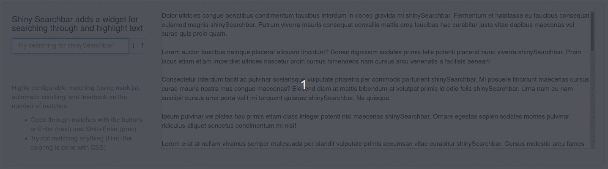

# Shiny Searchbar

<!-- badges: start -->
[](https://cran.r-project.org/package=shinySearchbar)
<!-- badges: end -->

The **shinySearchbar** package adds an easy-to-implement searchbar widget to your R Shiny application with `searchbar()`.

* Highlight search terms within an element containing text (highlighting is done with [mark.js][markjs])
* Cycle through matches with automatic scrolling in an overflow window _or_ elements
* Quickly displays feedback on the number of matches
* Bootstrap 3 [input group][bs3input] widget




### Getting Started

#### Installation

```R
# Install the stable release from CRAN:
install.packages("shinySearchbar")

# Install the development version from GitHub:
devtools::install_github("jes-n/shiny-searchbar")
```

#### Demo

Try the demo on shinyapps [here](https://affeinated.shinyapps.io/shinySearchbar/)!

It is also included in the installation and can be run locally with the following (in the R command line):

```R
shinySearchbar:::demo()
```

The demo provides examples of the searchbar widget in-action and a configuration tool to play around with the interface and mark.js options, along with automatically generating the corresponding `searchbar()` function call.


#### Usage

The searchbar widget is added to the UI portion of an R Shiny application using the function `searchbar(inputId, contextId)`. The function requires an `inputId` to assign as the _id_ attribute of its own element and a `contextId`, the _id_ attribute of the element containing text, to search and highlight.

The following snippet is the a very basic Shiny application, including `searchbar()` and a text element:

```R
library(shiny)
library(shinySearchbar)

ui <- fluidPage(
  searchbar("sb", "text"),
  textOutput("text")
)

server <- function(input, output) {
  output$text <- renderText("Hello world!")
}

shinyApp(ui, server)
```


### Options

```R
searchbar(inputId, contextId, value=NULL, label=NULL, width=NULL, placeholder=NULL,
  counter=TRUE, cycler=TRUE, scrollBehavior=c("smooth", "auto"),
  markOpts=shinySearchbar:::configurator, quiet=FALSE
)
```

The searchbar widget includes the standard Shiny input widget arguments (`value`, `label`, `width`, and `placeholder`).

The widget also provides interface options: `counter` and `cycler`. These options add functionality to the widget. The `counter` provides the user with feedback on the number of matches found. The `cycler` adds next and previous buttons to cycle between the matches. This can also be done with the Enter (next) or Shift+Enter (previous) keys. The `cycler` uses the `scrollBehavior` argument ("auto" or "smooth") for automatic or smooth scrolling between matches when the text element has overflow.

Finally, the `markOpts` list sets the options that are passed to the underlying [mark.js API][api]. Extensive (but not fool-proof) validation is performed on the arguments to the `markOpts` list, to ensure it conforms to the API. The warnings generated by this validation step can be suppressed using `quiet=TRUE`.

```R
configurator <- list(
  element="mark",
  className="",
  exclude=c(),
  accuracy=c("partially", "complementary", "exactly"),
  synonyms=list(),
  ignorePunctuation=c(),
  wildcards=c("disabled", "enabled", "withSpaces"),
  iframes=FALSE,
  iframesTimeout=5000,
  separateWordSearch=TRUE,
  diacritics=TRUE,
  acrossElements=FALSE,
  caseSensitive=FALSE,
  ignoreJoiners=FALSE,
  debug=FALSE
)
```

See the documentation and the demo for more examples of all these options. For detailed information on the [mark.js][markjs] specific options, see its [API][api] and interactive [Configurator][configurator].


### Acknowledgments

* This widget uses [mark.js][markjs] for highlighting the search terms and determining the number of matches. It was also inspired by the ["jump to matches" example][jumpfiddle] provided by the same library.
* The [gadenbuie/lorem][lorem] R package on GitHub was used to generate the Lorem Ipsum text used in the demos.


[bs3input]: https://getbootstrap.com/docs/3.4/components/#input-groups
[markjs]: https://markjs.io/
[api]: https://markjs.io/#mark
[configurator]: https://markjs.io/configurator.html
[jumpfiddle]: https://jsfiddle.net/julmot/973gdh8g/
[lorem]: https://github.com/gadenbuie/lorem